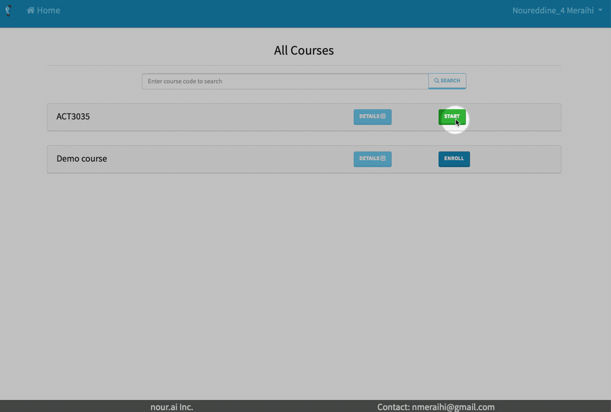
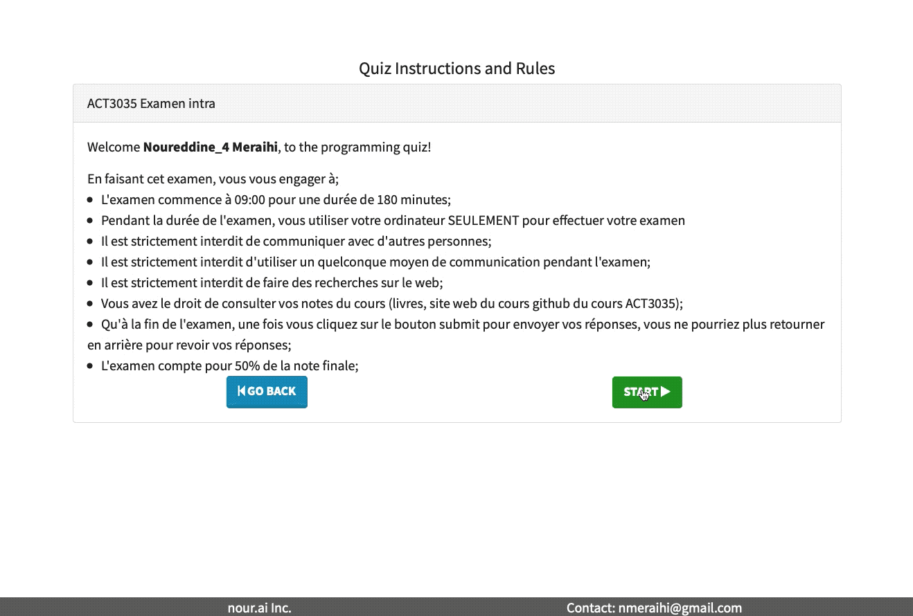
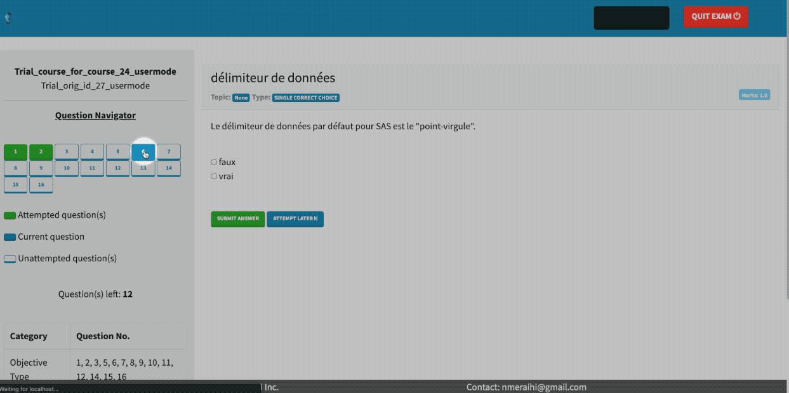
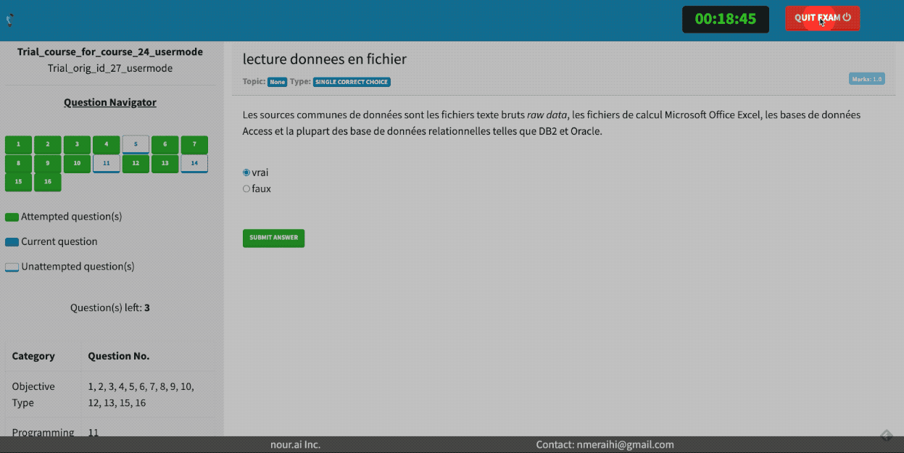

# Consignes générales

En vous connectant à la plateforme de l'examen intra du cours ACT3035, vous vous engager à respecter les règles suivantes;
* L'examen commence à 09:00 pour une durée de 180 minutes;
* Pendant la durée de l'examen, vous utiliser votre ordinateur **SEULEMENT** pour effectuer votre examen
* Il est strictement interdit d'utiliser un quelconque moyen de communication pendant l'examen avec qui que ce soit;
* Il est strictement interdit de faire des recherches sur le web;
* Vous avez le droit de consulter vos propre notes du cours ([les notes du cours ACT3035](https://nour.me/act3035book/sommaire) ainsi que [github du cours ACT3035](https://github.com/nmeraihi/ACT3035));
* Qu'une fois vous avez terminé l'examen, ou que le les 180 minutes sont écoulées, ou qu'à n'importe quel momemnt vous cliquez sur  une fois vous cliquez sur le bouton submit pour envoyez vos réponses, ces dernières seront envoyés et vous ne pourriez plus retourner en arrière pour revoir vos réponses;
* L'examen compte pour 50% de la note finale;

# Plateforme de l'examen ACT3035

* Suivez le [lien suivant](https://nour.ngrok.io/) afin d'avoir accès à la plateforme de l'examen
* Votre _Username_ est votre code permanant **BRUH123456**
* votre _Password_ temporaire (que vous pouvez changez si vous le souhaitez) sont les six premiers caractères de votre code permanant **BRUH12**

# Examen intra

## Page d'accueil
Cliquez sur le bouton **start** pour commencer la matière à intra

## Débuter l'examen

Lorsque vous cliquez sur le bouton **start** pour débuter l'examen, le temps 180 minutes accordé à cet examen débute alors. 

## Répondre au question à choix de réponse
Cliquez sur la réponse que vous choissez dans le choix de réponse, ensuite cliquez sur le bouton **submit answer** pour sauvegarder votre réponse ou sur le bouton **attempt later** pour passer à la question suivante.

Vous pouvez naviguez dans les question en cliquant sur les numéros de ceux-ci (tableau gauche)

## Fin de l'examen (questions à choix de réponses)

Lorsque vous finissez l'examen en cliquant sur le bouton **quit exam**, un résumé des dquestions compplétées (ou pas) vous serez affiché, lorsque vous cliquez sur le bouton **yes** poyr confirmer que vous quittez l'examen, vous ne pouvvez plus retourner en arrière pour revoir vos réponses.

## Trousse examen

Veuillez suivre la procédure [suivante](https://nbviewer.jupyter.org/github/nmeraihi/ACT3035/blob/master/AUT_2019/intra_A2019.ipynb) pour le téléchargement de l'intra 

## Dépôt intraoce
Veuillez suivre les même procédure [suivantes](https://nbviewer.jupyter.org/github/nmeraihi/ACT3035/blob/master/AUT_2019/depot_examen.ipynb):
